# 🚀 LMArena Bridge - The Next-Gen OpenAI Bridge 🌉

Welcome to the new generation of LMArena Bridge! 🎉 This is a high-performance toolset based on FastAPI and WebSocket, allowing you to seamlessly use the vast array of large language models from [LMArena.ai](https://lmarena.ai/) through any client or application compatible with the OpenAI API.

This refactored version aims to provide a more stable, maintainable, and extensible experience.

## ✨ Key Features

*   **🚀 High-Performance Backend**: Based on **FastAPI** and **Uvicorn** to provide an asynchronous, high-performance API service.
*   **🔌 Stable WebSocket Communication**: Uses WebSocket instead of Server-Sent Events (SSE) for more reliable, low-latency, two-way communication.
*   **🤖 OpenAI-Compatible Interface**: Fully compatible with OpenAI's `v1/chat/completions`, `v1/models`, and `v1/images/generations` endpoints.
*   **📎 Universal File Upload**: Supports uploading any file type (images, audio, PDFs, code, etc.) via Base64, including support for multiple files in a single request.
*   **🎨 Text-to-Image Generation Support**: New text-to-image feature allows calling LMArena's image generation models through a standard OpenAI interface.
*   **🗣️ Full Conversation History Support**: Automatically injects conversation history into LMArena to enable continuous, contextual dialogues.
*   **🌊 Real-Time Streaming Response**: Receive text responses from the model in real-time, just like the native OpenAI API.
*   **🔄 Automatic Model & Program Updates**:
    *   Automatically fetches the latest model list from the LMArena page on startup and intelligently updates `models.json`.
    *   Automatically checks the GitHub repository on startup and can download and apply updates when a new version is found.
*   **🆔 One-Click Session ID Updater**: Provides an `id_updater.py` script that automatically captures and updates the required session IDs in `config.jsonc` after a single action in your browser.
*   **⚙️ Browser Automation**: A companion userscript (`LMArenaApiBridge.js`) communicates with the backend server and performs all necessary actions within the browser.
*   **🍻 Tavern Mode**: Specially designed for applications like SillyTavern, it intelligently merges `system` prompts to ensure compatibility.
*   **🤫 Bypass Mode**: Attempts to bypass the platform's content filter by injecting an extra empty user message into the request.
*   **🔐 API Key Protection**: You can set an API Key in the configuration file to add a layer of security to your service.
*   **🎯 Advanced Model-Session Mapping**: Supports configuring independent session ID pools for different models and assigning specific working modes (`battle` or `direct_chat`) to each session for fine-grained request control.

## ⚙️ Configuration File Guide

The project's main behavior is controlled by [`config.jsonc`](./config.jsonc) and [`model_endpoint_map.json`](./model_endpoint_map.json).

### `config.jsonc` - Global Configuration

This is the main configuration file containing the server's global settings.

*   `session_id` / `message_id`: The global default session IDs. These are used when a model does not have a specific mapping in `model_endpoint_map.json`.
*   `id_updater_last_mode` / `id_updater_battle_target`: The global default request mode. Similarly, this is used when a specific session does not have a designated mode.
*   `use_default_ids_if_mapping_not_found`: A very important switch (defaults to `true`).
    *   `true`: If the requested model is not found in `model_endpoint_map.json`, the global default IDs and mode will be used.
    *   `false`: If no mapping is found, an error is returned. This is useful when you need to strictly control the session for each model.
*   For other configuration options like `api_key`, `tavern_mode_enabled`, etc., please refer to the comments within the file.

### `model_endpoint_map.json` - Model-Specific Configuration

This is a powerful advanced feature that allows you to override global settings and configure one or more dedicated sessions for specific models.

**Key Advantages**:
1.  **Session Isolation**: Use separate sessions for different models to prevent context crosstalk.
2.  **Increased Concurrency**: Configure an ID pool for popular models. The program will randomly select an ID for each request, simulating round-robin to reduce the risk of a single session being rate-limited.
3.  **Mode Binding**: Bind a session ID to the mode it was captured in (`direct_chat` or `battle`) to ensure requests are always formatted correctly.

**Configuration Example**:
```json
{
  "claude-3-opus-20240229": [
    {
      "session_id": "session_for_direct_chat_1",
      "message_id": "message_for_direct_chat_1",
      "mode": "direct_chat"
    },
    {
      "session_id": "session_for_battle_A",
      "message_id": "message_for_battle_A",
      "mode": "battle",
      "battle_target": "A"
    }
  ],
  "gemini-1.5-pro-20241022": {
      "session_id": "single_session_id_no_mode",
      "message_id": "single_message_id_no_mode"
  }
}
```
*   **Opus**: An ID pool is configured. When a request is made, one of the IDs will be chosen at random, and the request will strictly follow its bound `mode` and `battle_target`.
*   **Gemini**: A single ID object is used (old format, still compatible). Since it does not specify a `mode`, the program will automatically use the global mode defined in `config.jsonc`.

## 🛠️ Installation and Usage

You will need a Python environment and a browser that supports userscripts (e.g., Chrome, Firefox, Edge).

### 1. Prerequisites

*   **Install Python Dependencies**
    Open a terminal, navigate to the project's root directory, and run the following command:
    ```bash
    pip install -r requirements.txt
    ```

*   **Install a Userscript Manager**
    Install the [Tampermonkey](https://www.tampermonkey.net/) extension for your browser.

*   **Install This Project's Userscript**
    1.  Open the Tampermonkey extension's dashboard.
    2.  Click "Create a new script".
    3.  Copy all the code from the [`TampermonkeyScript/LMArenaApiBridge.js`](TampermonkeyScript/LMArenaApiBridge.js) file and paste it into the editor.
    4.  Save the script.

### 2. Run the Main Program

1.  **Start the Local Server**
    In the project's root directory, run the main server program:
    ```bash
    python api_server.py
    ```
    When you see the server start on `http://127.0.0.1:5102`, it means the server is ready.

2.  **Keep an LMArena Page Open**
    Make sure you have at least one LMArena tab open and that the userscript has successfully connected to the local server (the page title will start with a `✅`). You don't need to stay on a chat page; any page on the LMArena domain, like the Leaderboard, will work.

### 3. Configure Session ID (Only needed once, unless switching models or the session expires)

This is the **most important** step. You need to obtain a valid session ID and message ID so the program can communicate correctly with the LMArena API.

1.  **Ensure the Main Server is Running**
    `api_server.py` must be running because the ID updater needs it to activate the capture mode in the browser.

2.  **Run the ID Updater**
    Open a **new terminal**, and in the project's root directory, run the `id_updater.py` script:
    ```bash
    python id_updater.py
    ```
    *   The script will prompt you to choose a mode (DirectChat / Battle).
    *   After you choose, it will notify the running main server.

3.  **Activate and Capture**
    *   At this point, you should see a crosshair icon (🎯) appear at the beginning of the title of the LMArena tab in your browser. This indicates that **ID capture mode is active**.
    *   In the browser, navigate to a page where the **target model has sent a message**. Note: If it's a Battle page, do not reveal the model names; keep them anonymous and ensure the last message in the interface is a response from the target model. If it's a Direct Chat, ensure the last message is a response from the target model.
    *   **Click the Retry button in the top-right corner of the target model's response card.**
    *   The userscript will capture the `sessionId` and `messageId` and send them to `id_updater.py`.

4.  **Verify the Result**
    *   Go back to the terminal where you ran `id_updater.py`. You will see it print the successfully captured IDs and confirm that they have been written to the `config.jsonc` file.
    *   The script will exit automatically upon success. Your configuration is now complete!

3.  **Configure Your OpenAI Client**
    Point your client or application's OpenAI API address to the local server:
    *   **API Base URL**: `http://127.0.0.1:5102/v1`
    *   **API Key**: If `api_key` in `config.jsonc` is empty, you can enter anything. If it is set, you must provide the correct key.
    *   **Model Name**: The model is no longer determined locally. It is determined by the message you clicked "Retry" on in your LMArena conversation. Therefore, make sure to find a conversation with your desired model in either Direct Chat or Battle beforehand. For Direct Chat, you can use the userscript **LMArenaDirectChat模型注入 (仙之人兮列如麻) V5.js** provided by DC big shots to select your model (the newest test models like wolfstride may not be available for direct chat and must be captured in Battle).

4.  **Start Chatting!** 💬
    You can now use your client as usual. All requests will be proxied through the local server to LMArena!

## 🤔 How Does It Work?

This project consists of two parts: a local Python **FastAPI** server and a **userscript** running in the browser. They work together via **WebSocket**.

```mermaid
sequenceDiagram
    participant C as OpenAI Client 💻
    participant S as Local FastAPI Server 🐍
    participant U as ID Updater Script (id_updater.py) 🆔
    participant T as Userscript 🐵 (in LMArena page)
    participant L as LMArena.ai 🌐

    alt Initialization & ID Update
        T->>+S: (Page Load) Establish WebSocket connection
        S-->>-T: Confirm connection
        U->>+S: (User runs) POST /internal/start_id_capture
        S->>T: (WebSocket) Send 'activate_id_capture' command
        Note right of T: Capture mode activated (one-time)
        T->>L: (User clicks Retry) Intercepts fetch request
        T->>U: (HTTP) Send captured IDs
        U-->>T: Acknowledge
        U->>U: Update config.jsonc
    end

    alt Normal Chat Flow
        C->>+S: (User chats) /v1/chat/completions request
        S->>S: Convert request to LMArena format
        S->>T: (WebSocket) Send message with request_id and payload
        T->>L: (fetch) Send real request to LMArena API
        L-->>T: (Streaming) returns model response
        T->>S: (WebSocket) Send response chunks back
        S-->>-C: (Streaming) Return OpenAI-formatted response
    end

    alt Image Generation Flow
        C->>+S: (User requests) /v1/images/generations request
        S->>S: (Parallel) Create n tasks
        S->>T: (WebSocket) Send n tasks with request_id
        T->>L: (fetch) Send n real requests
        L-->>T: (Streaming) Return image URL
        T->>S: (WebSocket) Send URL back
        S-->>-C: (HTTP) Return JSON response with all URLs
    end
```



1.  **Establish Connection**: When you open an LMArena page in your browser, the **userscript** immediately establishes a persistent **WebSocket connection** with the **local FastAPI server**.
    > **Note**: The current architecture assumes only one browser tab is active. If multiple pages are open, only the last connection will be effective.
2.  **Receive Request**: The **OpenAI client** sends a standard chat request to the local server.
3.  **Task Distribution**: The server receives the request, converts it to the format LMArena requires, attaches a unique request ID (`request_id`), and sends this task to the connected userscript via WebSocket.
4.  **Execution and Response**: Upon receiving the task, the userscript initiates a `fetch` request directly to LMArena's API endpoint. As LMArena returns a streaming response, the userscript captures these data chunks and sends them back to the local server, piece by piece, via WebSocket.
5.  **Response Relay**: The server uses the `request_id` attached to each chunk to place it in the correct response queue and streams this data back to the OpenAI client in real-time.

## 📖 API Endpoints

### Get Model List

*   **Endpoint**: `GET /v1/models`
*   **Description**: Returns an OpenAI-compatible list of models, read from the `models.json` file.

### Chat Completions

*   **Endpoint**: `POST /v1/chat/completions`
*   **Description**: Accepts standard OpenAI chat requests, supporting both streaming and non-streaming responses.

### Image Generation

*   **Endpoint**: `POST /v1/images/generations`
*   **Description**: Accepts standard OpenAI text-to-image requests and returns the generated image URLs.
*   **Request Example**:
    ```bash
    curl http://127.0.0.1:5102/v1/images/generations \
      -H "Content-Type: application/json" \
      -d '{
        "prompt": "A futuristic cityscape at sunset, neon lights, flying cars",
        "n": 2,
        "model": "dall-e-3"
      }'
    ```
*   **Response Example**:
    ```json
    {
      "created": 1677663338,
      "data": [
        {
          "url": "https://..."
        },
        {
          "url": "https://..."
        }
      ]
    }
    ```

## 📂 File Structure

```
.
├── .gitignore                  # Git ignore file
├── api_server.py               # Core backend service (FastAPI) 🐍
├── id_updater.py               # One-click Session ID updater script 🆔
├── models.json                 # Maps model names to LMArena internal IDs 🗺️
├── model_endpoint_map.json     # [Advanced] Maps models to dedicated session IDs 🎯
├── requirements.txt            # Python dependency list 📦
├── README.md                   # The file you are reading right now 👋
├── config.jsonc                # Global feature configuration file ⚙️
├── modules/
│   ├── image_generation.py     # Image generation module 🎨
│   └── update_script.py        # Auto-update logic script 🔄
└── TampermonkeyScript/
    └── LMArenaApiBridge.js     # Frontend automation userscript 🐵
```

**Enjoy exploring the world of models on LMArena!** 💖
